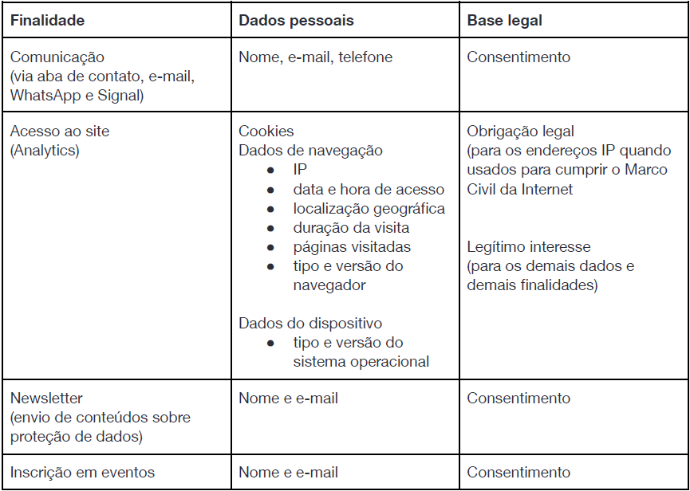

# Política de Privacidade
{: .no_toc }

Como as suas informações e dados serão coletados, usados, compartilhados, armazenados e protegidos pela Casa Hacker
{: .fs-6 .fw-300 }

## Índice
{: .no_toc .text-delta }

1. TOC
{:toc}

---
## Introdução
Olá! Seja bem-vindo(a)!

Este site e todo o seu conteúdo é de responsabilidade e operado pela Associação Casa Hacker, associação sem fins lucrativos sediada em São Paulo, com endereço Rua Luverci Pereira de Souza, 545 - Cidade Universitária, Campinas - SP, 13083-725, e cadastrada com o CNPJ 36.038.079/0001-97 ("Casa Hacker").

Quando você navega por este site, você nos confia dados e informações capazes de identificá-lo(a) como pessoa física – ou seja, dados pessoais. Nos comprometemos a manter essa confiança. 

A aceitação desta Política será feita quando você acessar ou usar o site ou serviços da Casa Hacker.

Caso tenha dúvidas ou precise tratar de qualquer assunto relacionado a esta Política, entre em contato conosco através do endereço de e-mail privacidade@casahacker.org.

## Objetivo
Informar a você, de maneira objetiva e acessível, como as suas informações e dados serão coletados, usados, compartilhados, armazenados e protegidos pela Casa Hacker, bem como a forma como você pode realizar o controle de seus dados pessoais.

## Quais dados pessoais nós coletamos de você?
A Casa Hacker somente coleta dados pessoais dos usuários que navegam em nosso site.

Dados pessoais dizem respeito a qualquer informação que possa ser utilizada para identificar uma pessoa. Alguns exemplos comuns de dados pessoais são informações comuns de identificação, como nome, CPF, RG, fotografias, endereço, entre outras. Além disso, informações menos óbvias, mas que também permitam a identificação da pessoa, também são dados pessoais. Alguns exemplos disso são dados de utilização de Internet e registros digitais que permitam a identificação de indivíduos, como endereço IP, porta lógica de origem, informações relativas às configurações do equipamento utilizado para acessar a rede etc.

Nós coletamos o mínimo possível de dados pessoais necessários para alcançar as finalidades para as quais esses mesmos dados são coletados, conforme informado na tabela abaixo. Nós utilizamos esses dados pessoais apenas para a finalidade específica correlacionada na tabela, valendo-se da(s) base(s) legal(is) pré-determinada(s) para tanto.

## Por que nós coletamos dados mediante cookies?
Alguns dados pessoais são voluntariamente oferecidos por você (como, por exemplo, dados de contato). No entanto, quando você acessa este site, outros dados pessoais podem ser coletados pela Casa Hacker de forma automática, por meio de cookies e outras tecnologias de monitoramento assemelhadas (“cookies” ou “rastreadores”).

Cookies são pequenos arquivos que o site envia para o seu navegador e são armazenados no seu dispositivo, permitindo a coleta de informações a seu respeito de maneira automática, como, por exemplo, seu idioma, sua recorrência de acesso ao site etc.

A Casa Hacker utiliza os seguintes tipos de cookies quando você acessa o nosso site:
- Cookies essenciais: são utilizados para coletar informações que permitam o correto e adequado funcionamento do site quando do seu acesso (por exemplo, são usados para identificar os usuários, garantir o controle de verificações, ajustar a exibição do conteúdo ao equipamento, etc.).
- Cookies de análise (analytics): são usados para coletar informações sobre a sua utilização do site, assim podemos avaliar como são suas interações com o site para melhorar não só os nossos serviços, mas também a sua experiência no acesso ao site (por exemplo, com que frequência você acessa o site, informações sobre cliques nas páginas do site, etc.). 
- Cookies de preferências: são utilizados para coletar informações que nos permitam verificar quais são seus interesses e preferências, a fim de que possamos oferecer os nossos serviços que sejam relacionados aos seus interesses (por exemplo, qual o tipo de conteúdo você mais acessa, preferências no uso dos sites etc.). 

Com exceção dos cookies essenciais, que não podem ser desabilitados, pois isso inviabilizaria o seu acesso ao site, você poderá, a qualquer tempo, desativar o uso dos demais cookies ou até mesmo deletá-los, por meio da realização de ajustes nas configurações de seu navegador ou dispositivo. Recomendamos que você visite o site do navegador que você utiliza ou do fabricante de seu dispositivo para obter maiores informações sobre como proceder.

## Com quem nós compartilhamos os seus dados pessoais?
Todas as informações coletadas pela Casa Hacker sobre você são confidenciais. Em hipótese alguma nós venderemos as suas informações. No entanto, podemos compartilhá-las com terceiros, inclusive seus dados pessoais, caso seja necessário para:
- Prestação de nossos serviços: seus dados pessoais podem ser compartilhados com alguns de nossos parceiros e fornecedores, a fim de viabilizarmos a prestação dos nossos serviços a você, por exemplo, empresas que prestem serviços de hospedagem de dados para armazenamento da nossa base de dados, empresas que hospedem nosso site e nossos e-mails, empresas que ofereçam plataformas para o envio de e-mails, entre outras.
- Acesso ao site: seus dados pessoais podem ser compartilhados com alguns de nossos parceiros e fornecedores de serviços de web analytics, para possibilitar que você acesse o site sem problemas e para que nós, a partir de uma avaliação das suas interações com o site, possamos compreender como melhorar nossos serviços e a sua experiência no acesso ao site. 
- Resguardo de direitos: a Casa Hacker poderá compartilhar seus dados pessoais com terceiros caso seja necessário para resguardar os nossos direitos e interesses, cumprir uma obrigação legal relacionada aos seus negócios ou atender a uma ordem judicial (por exemplo, com escritórios de advocacia, escritórios de contabilidade, Poder Judiciário, Prefeitura do Município de São Paulo, Ministério Público, Órgãos de Defesa do Consumidor, autoridades da Administração Pública, entre outros).

Em todos os casos, os seus dados pessoais somente serão compartilhados com terceiros para atender as finalidades aqui descritas e no estrito limite necessário para que tal finalidade seja atingida. A Casa Hacker, sempre que possível, irá pseudonimizar os seus dados pessoais antes do compartilhamento e solicitará aos terceiros que mantenham a confidencialidade e segurança das informações compartilhadas.

## Como nós protegemos seus dados pessoais?
Nós nos esforçamos para proteger a sua privacidade e os seus dados pessoais de acessos não autorizados, destruição, perda, alteração, comunicação, divulgação ou qualquer forma de tratamento inadequado ou ilícito. Para tanto, nós adotamos medidas técnicas, administrativas e organizacionais de segurança.

A fim de manter os seus dados pessoais seguros e evitar incidentes, nós empregamos o uso de logins e senhas para acesso aos servidores onde estão armazenados os dados pessoais e armazenamos os logs de acesso a tais servidores para realizar o controle e manter atualizado o inventário de acesso aos dados. Também realizamos cópias de segurança dos dados periodicamente (backups) e utilizamos técnicas de criptografia. 

Todos os softwares, ferramentas e tecnologias adotadas pela Casa Hacker no tratamento de dados pessoais levam em consideração as práticas de mercado e contam com um nível razoável de atualização. 

Você deve colaborar para manter a segurança de seus dados pessoais, assegurando que o ambiente de seu computador ou dispositivo de acesso ao site permaneçam seguros, a partir:
1. do uso de ferramentas adequadas, como, por exemplo, antivírus e firewall;
2. da utilização de versões atualizadas de navegadores, sistemas operacionais e demais software aplicáveis;
3. bem como do não compartilhamento de seus logins e senhas com terceiros.

A Casa Hacker não solicitará por e-mail, telefone ou mensagem informações relativas a suas senhas de acesso ou quaisquer informações pessoais a seu respeito. Caso você suspeite que os seus dados pessoais estejam em risco, você deve entrar em contato conosco.

## Quais são seus direitos sobre os seus dados pessoais?
Você possui alguns direitos inerentes à sua condição de titular dos dados pessoais. Esses direitos visam proteger os seus dados pessoais e resguardar a sua privacidade. Listamos abaixo quais são esses direitos e como você pode exercê-los perante a Casa Hacker:
- Existência e acesso: você tem o direito de confirmar se nós realizamos algum tratamento com seus dados pessoais, bem como ter acesso aos seus dados pessoais tratados por nós, mediante a solicitação e o recebimento de um documento contendo a cópia integral de seus dados pessoais e o respectivo tratamento realizado com ele. 
- Retificação: você tem o direito de solicitar a correção ou a atualização de seus dados pessoais, caso verifique que eles estão incorretos ou desatualizados.
- Explicação: você tem o direito de obter informações sobre o tratamento realizado por nós com seus dados pessoais, como, por exemplo, quais dados pessoais seus são coletados, como eles são utilizados, com quem são compartilhados e por que, entre outras informações. Essa Política de Privacidade visa oferecer todas as informações necessárias para garantir que esse direito seja atendido. Caso você não compreenda alguma questão aqui abordada, ou identifique a omissão de algum assunto, você pode solicitar esclarecimentos à Casa Hacker.
- Cancelamento: você tem o direito de solicitar a exclusão de seus dados pessoais da nossa base de dados de forma definitiva, solicitar que eles sejam anonimizados ou, ainda, requerer que o tratamento dos seus dados pessoais pela Casa Hacker seja bloqueado. A Casa Hacker irá sempre atender a sua requisição, exceto com relação aos pedidos de exclusão e anonimização quando a manutenção do dado pessoal for necessária para a Casa Hacker resguardar seus direitos e/ou cumprir obrigações legais. Você está ciente de que nos casos de exclusão, anonimização e bloqueio, você poderá ficar impossibilitado de acessar determinados recursos oferecidos por nós.
- Oposição: você tem o direito de contestar determinado tratamento de seus dados pessoais, bem como de retirar o seu consentimento que esteja atrelado à determinada finalidade de tratamento. Neste último caso, a Casa Hacker poderá continuar tratando os seus dados pessoais, caso o tratamento esteja amparado por outra base legal que não seja o consentimento. Em caso de contestação a Casa Hacker poderá demonstrar que trata os seus dados pessoais dentro da legalidade. 
- Portabilidade: você tem o direito de solicitar que os dados pessoais armazenados pela Casa Hacker sobre você lhe sejam enviados, ou enviados aos terceiros que você indicar, em formato estruturado e interoperável.
- Revisão de decisões automatizadas: você tem o direito de solicitar a revisão de decisões que tenham afetado seus interesses e tenham sido tomadas a partir de um tratamento automatizado de seus dados pessoais. Embora essa prerrogativa esteja prevista na legislação, as decisões tomadas pela Casa Hacker não são automatizadas, de maneira que esse direito não é aplicável.

Você poderá exercer qualquer um dos direitos aqui descritos, a qualquer momento, por procedimento gratuito e facilitado. Para tanto, basta encaminhar uma solicitação à Casa Hacker através do e-mail privacidade@casahacker.org. Nós empregaremos nossos melhores esforços para atender a todos os pedidos no menor espaço de tempo possível. 

## Seus dados podem ser transferidos para o exterior?
A Casa Hacker armazena a sua base de dados em servidores de terceiros, contratados para esta finalidade, que podem estar localizados no exterior. Nesses casos, a Casa Hacker garante que os seus dados pessoais somente serão enviados para um país cuja autoridade nacional de proteção de dados considere ter um grau de proteção de dados pessoais adequado ou desde que todos os requisitos previstos na legislação brasileira aplicável relacionados à transferência internacional sejam cumpridos. 

Em específico, a Casa Hacker utiliza as serviços do Microsoft Azure (Microsoft), Amazon Web Services (Amazon Web Services, Inc.), Digital Ocean (Digital Ocean, Inc.), Bússola Social (Bussola Tecnologia Social LTDA), Webflow, Inc., do Google Workspace (Google LLC) e Mailchimp (The Rocket Science Group LLC) no gerenciamento de suas páginas on-line, para averiguação de métricas possibilitadas pelo uso de cookies e para hospedar dados e conteúdo. Dessa forma, essas informações são armazenadas em servidores dessas empresas localizados fora do Brasil, o que constitui a única situação de transferência internacional de dados realizada pela Casa Hacker.

## Por quanto tempo os dados pessoais são armazenados?
Todos os dados pessoais coletados pela Casa Hacker são armazenados pelo período necessário para atender as finalidades descritas nesta Política de Privacidade ou até que você, como titular, exerça os seus direitos de oposição ou cancelamento, solicitando a exclusão do dado pessoal ou retirando o seu consentimento. Uma vez que os dados pessoais não sejam mais necessários ou relevantes para a finalidade específica ou que você exerça, como titular, os direitos aqui mencionados, eles serão excluídos de nossa base de dados. 

Todavia, mesmo que a finalidade tenha sido concluída ou que você tenha retirado seu consentimento ou solicitado a exclusão de seus dados pessoais, a Casa Hacker poderá mantê-los armazenados, se necessário para resguardar seus direitos, cumprir ordens judiciais ou requisições emanadas de autoridades competentes, bem como para cumprir de obrigações legais e regulatórias (como, por exemplo, para fins de prestação de contas, armazenamento do registro de acesso ao site etc.).

## Quando esta política poderá ser alterada?
A Casa Hacker constantemente implementa atualizações no site e nos seus serviços, de forma que tais atualizações podem refletir na forma como os seus dados pessoais são tratados. Assim, sempre que houver modificações no tratamento, esta Política de Privacidade poderá ser alterada. As alterações poderão ocorrer a qualquer tempo e quantas vezes forem necessárias. Por esse motivo, é importante que você revise essa Política de Privacidade periodicamente para estar a par dessas modificações. No início desta Política de Privacidade indicamos a data da última atualização.

Sempre que houver uma atualização desta Política de Privacidade, a Casa Hacker empreenderá esforços razoáveis para tornar isso transparente. Caso a atualização seja relevante e possa impactar nos direitos do usuário, sendo necessário um novo consentimento a respeito de determinado tratamento, a Casa Hacker fará uma solicitação diretamente à você, caso você seja um usuário cadastrado.

## Qual a Lei aplicável a esta Política?
Este documento é regido e deve ser interpretado de acordo com as leis da República Federativa do Brasil. Fica eleito o foro da comarca de São Paulo, Estado de São Paulo como o competente para dirimir quaisquer questões porventura oriundas do presente documento.

## Contate a Casa Hacker
Caso você queira ter acesso, alterar e/ou queira excluir seus dados pessoais armazenados por nós, ou mesmo caso você tenha alguma dúvida ou contestação, você poderá entrar em contato conosco para todas essas finalidades utilizando as informações de contato indicadas abaixo.

Associação Casa Hacker
A/C Geraldo Barros, Diretor de Proteção de Dados
E-mail: privacidade@casahacker.org

## Vigência
A presente Política entra em vigor a contar da data de sua aprovação permanecendo válida e aplicável até seja alterada.
